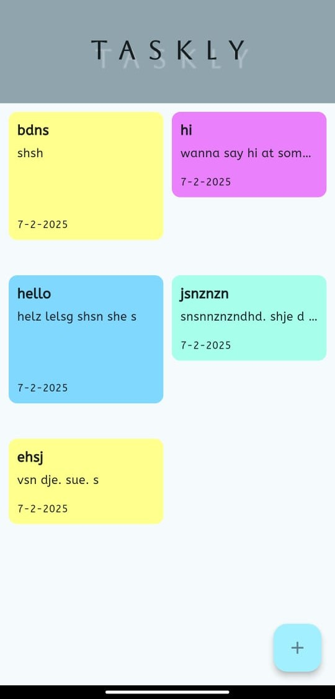
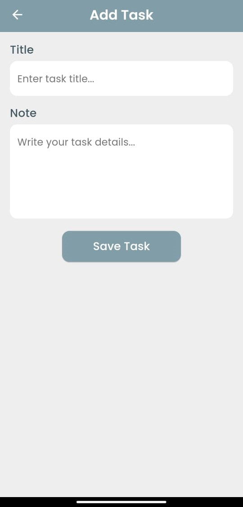

# 📝 Task & Notes Tracker  

A **Flutter-based Android & iOS app** for managing tasks and taking notes efficiently. 🚀  
Built with **Hive** for fast, lightweight, and offline-capable storage.  

---

## 📌 Features  

✅ **Task Management** – Create, update, and complete tasks with ease.  
✅ **Notes Organizer** – Store, edit, and delete notes on the go.  
✅ **Offline Support** – Works without an internet connection using **Hive**.  
✅ **Lightweight & Fast** – Optimized for performance and minimal storage usage.

---

## 🏗️ Tech Stack  

### 📱 **Frontend**  
- **Flutter (Dart)** – Cross-platform UI development.  

### 💾 **Database**  
- **Hive** – Fast & NoSQL storage for offline data persistence.  

---

## 📸 Screenshots  

### 🏠 Home Screen  


### ➕ Add Task  


---

## 🚀 How to Run  

1️⃣ **Clone the repo:**  
```bash
git clone https://github.com/Huzaifa-Muhammed/Todo-APP.git
cd Todo-APP
flutter pub get
flutter run
